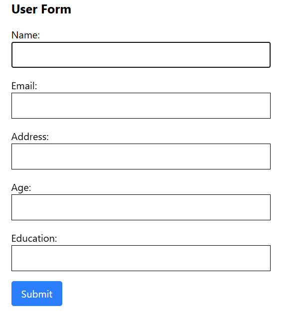
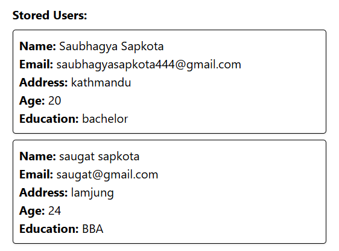

# Upachaar Nepal Learning

This repository consists of topics learned and works done at Upachaar Nepal as a Software Developer Intern.

## Topic Learned on (2025-07-28)

**Redux**
- A state management library for JS applications.
- Lets store, update and manage application's global state in a single place, making easier to share data across components.

**Redux Toolkits**
- Creating the store
- Writing reducers and actions
- Handling async logic
- Reducing boilerplate code

## Task Done (2025-07-28)
- Created a Form the stores user's details and display it below using redux toolkit.

## Topic Learned on (2025-07-27)

**React Query (TanStack Query)**
- A JavaScript library for managing server state in React apps.
- Used for data fetching, caching, sunchronization and updating server-side data.

**QueryClientProvider**
- A container that sets up React Query in apps.
- It handles all queries and mutations. 

**useQuery**
- Used to Fetch data (like GET request).

**useMutation**
- Used for changing data (like POST, PUT, DELETE)

## Task Done (2025-07-27)
- Created form to register and login users.
- Connected frontend and backend, and data were sent and received through REST-APIs.

## Topic Learned on (2025-07-25)

**Code Splitting**
- A technique for breaking JavaScript code in smaller chunks which can be loaded on demand.
- React supports code splitting through dynamic import() and React.lazy.

**Lazy Loading**
- It is a way to load components only when they are needed.
- It reduces initial bundle size.

**React Suspence**
- A react components used to wrap lazy-loaded components and show a fallback UI while the component is being loaded.

## Task Done (2025-07-25)
- Created a login page using react hook form.

## Topic Learned on (2025-07-24)

**useMemo hook in React**
- It caches a computed value so it's not recalcualted on every render unless dependencies change.

**useCallback hook in React**
- It caches a function so it's not recreated on every render unless dependencies change.

**Custom hooks in React**
- Reusable functions that use React hooks (useState, useEffect, etc) inside them.
- Helps in Encapsulate logic, reuse code across components.

**Error Boundaries** 
- A component that catches JavaScript errors in its child components tree, and logs those errors.
- And display a fallback UI instead of crashing the whole app.

## Task Done (2025-07-24)
- Created a component for searching Github users.
- Fetched user example:

## Topic Learned on (2025-07-23)

**useContext hook in React** 
- Helps to consume values from a React Context directly, without needing to pass props manually through every component level.