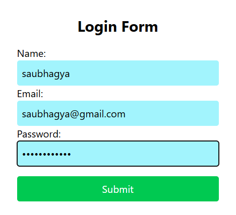

# Upachaar Nepal Learning

This repository consists of topics learned and works done at Upachaar Nepal as a Software Developer Intern.

## Topic Learned on (2025-07-25)

**Code Splitting**
- A technique for breaking JavaScript code in smaller chunks which can be loaded on demand.
- React supports code splitting through dynamic import() and React.lazy.

**Lazy Loading**
- It is a way to load components only when they are needed.
- It reduces initial bundle size.

**React Suspence**
- A react components used to wrap lazy-loaded components and show a fallback UI while the component is being loaded.

## Task Done (2025-07-25)
- Created a login page using react hook form.
- Login Page:

## Topic Learned on (2025-07-24) 

**useMemo hook in React**
- It caches a computed value so it's not recalcualted on every render unless dependencies change.

**useCallback hook in React**
- It caches a function so it's not recreated on every render unless dependencies change.

**Custom hooks in React**
- Reusable functions that use React hooks (useState, useEffect, etc) inside them.
- Helps in Encapsulate logic, reuse code across components.

**Error Boundaries**
- A component that catches JavaScript errors in its child components tree, and logs those errors.
- And display a fallback UI instead of crashing the whole app.

## Task Done (2025-07-24)
- Created a component for searching Github users.
- Fetched user example:

## Topic Learned on (2025-07-23)
- Helps to consume values from a React Context directly, without needing to pass props manually through every component level.